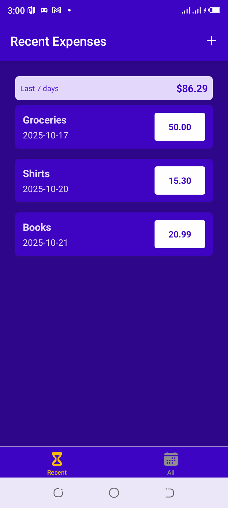

# 💰 Expense Tracker App

An elegant and intuitive mobile application built to help users track their daily expenses efficiently. The Expense
Tracker allows users to record, view, and categorize their spending while providing an easy way to monitor financial
habits over time.

# 🖼️ Screenshot

# 🧭 Table of Contents

## Overview

## Features

## App Structure

## Technologies Used

## Project Setup

## Future Improvements

Author

## 📖 Overview

The Expense Tracker enables users to log detailed expense information — such as the name of the expense, amount spent,
and date. These entries are automatically divided into two main views:

🧾 All Expenses – Displays every recorded expense along with the overall total.

📅 Recent Expenses – Shows only expenses made within the last 7 days, along with a 7-day total.

The app supports local data storage for offline usage and can also be configured to store data on a backend, such as
Firebase or a custom backend API.

## ✨ Features

➕ Add new expenses with name, amount, and date.

🗂️ Automatically categorized into All and Recent expenses.

💾 Data persistence using local storage (and optional backend storage).

📱 Smooth navigation using both stack and tab navigators.

📊 View total amounts for both categories in real time.

🧭 Responsive and intuitive user interface.

## 🧩 App Structure

The app uses React Navigation for routing and screen management, with a hybrid setup combining:

Native Stack Navigator – for screen transitions and hierarchical navigation.

Bottom Tabs Navigator – for easy switching between All Expenses and Recent Expenses.

## 🛠️ Technologies Used

⚛️ React Native – Core framework for building cross-platform mobile apps.

🚀 Expo – For development, testing, and deployment.

🧭 React Navigation – For routing and navigation between screens.

🔥 Firebase (optional) – For backend data storage and synchronization.

💾 Local Storage / AsyncStorage – For saving data on the device.

🎨 CSS-in-JS / Styled Components – For UI design and component styling.

## ⚙️ Project Setup

To run this project locally:

1. Clone the repository

git clone https://github.com/<your-username>/expense-tracker.git

2. Navigate into the project folder

cd expense-tracker

3. Install dependencies

npm install

# or

yarn install

4. Start the development server

npx expo start

## 🚧 Future Improvements

☁️ Integration with cloud backends (Firebase / custom REST API).

📊 Add expense filtering by category and date range.

🧾 Include visual charts and analytics dashboards.

🌙 Add light/dark mode themes.

🔔 Add reminders for recurring expenses.

👤 Author

Tonye Hugo Onuoha 📧 tonyeonuoha@gmail.com
